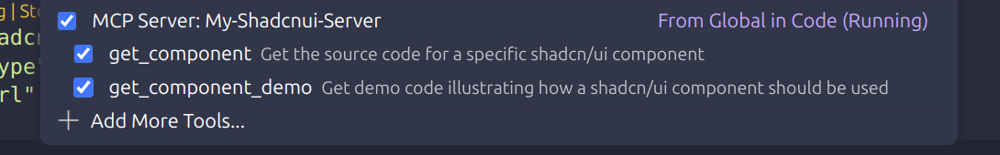
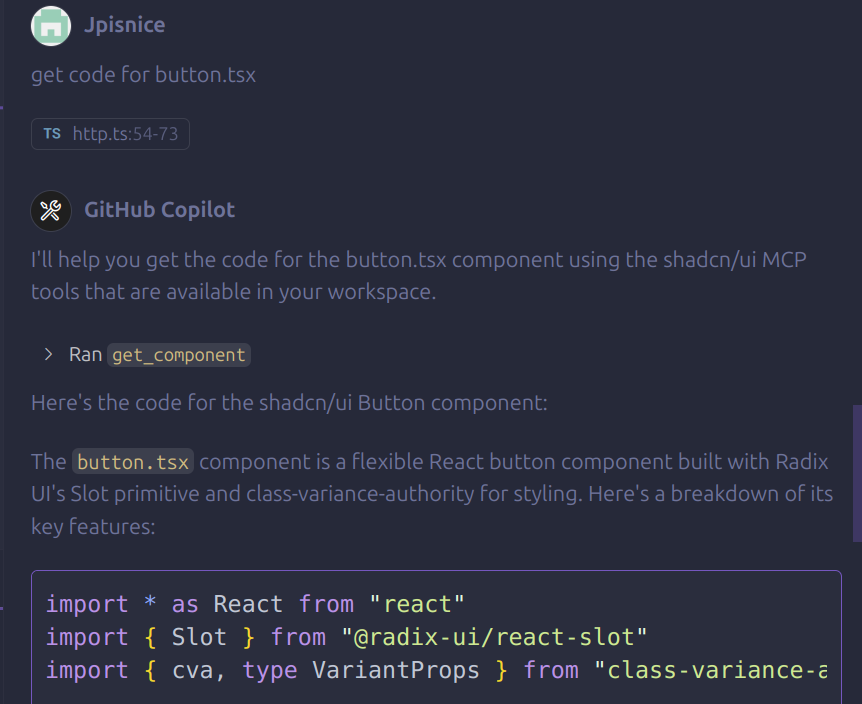

# Shadcn UI MCP Server

A TypeScript implementation of a Model Context Protocol (MCP) server that helps AI assistants access and work with shadcn/ui components. This server acts as a bridge between AI models like Claude and shadcn/ui, enabling assistants to fetch component source code, demos, and installation guides.

## Project Overview

This MCP server provides tools and resources to help AI assistants:
- Get shadcn/ui component source code
- Get component demo code and usage examples
- Generate installation instructions for shadcn/ui components
- Provide framework-specific installation guides

## Project Structure

```
shadcn-ui-mcp-unofficial/
├── build/             # Compiled JavaScript files
│   ├── handler.js
│   ├── http.js
│   ├── index.js
│   ├── prompts.js
│   ├── resource-templates.js
│   ├── resources.js
│   ├── tools.js
│   ├── schemas/       # Compiled schemas
│   │   └── component.js
│   └── types/         # Compiled type definitions
│       ├── component.js
│       └── doc.js
├── docs/              # Documentation assets
│   └── images/        # Images for documentation
│       ├── chat-interface.png
│       └── server-configured.png
├── src/               # TypeScript source files
│   ├── handler.ts     # Request handlers implementation
│   ├── http.ts        # HTTP server implementation
│   ├── index.ts       # Server entry point
│   ├── prompts.ts     # Prompt definitions
│   ├── resource-templates.ts # Templates for installation guides
│   ├── resources.ts   # Resource definitions for component listing
│   ├── tools.ts       # Tool definitions for component retrieval
│   ├── schemas/       # JSON schemas for validation
│   │   └── component.ts
│   ├── types/         # TypeScript type definitions
│   │   ├── component.ts
│   │   └── doc.ts
│   └── utils/         # Utility functions and API clients
│       ├── api.ts
│       ├── axios.ts
│       └── cache.ts
├── package.json       # Project dependencies and scripts
├── README.md          # Project documentation
├── startup.sh         # Script to clean, build, and start the server
├── todo.md            # Project TODO list
└── tsconfig.json      # TypeScript configuration
```

## Getting Started

### Prerequisites

- Node.js (v18 or later recommended)
- npm

### Installation

```bash
npm install
```

### Running the Server

Use the startup script to clean, build, and start the server:

```bash
bash startup.sh
```

Or run the individual commands:

```bash
npm run clean
npm run build
npm run start # starts MCP inspector on default port
```

## Features

### Tools

This MCP server implements the following tools:

#### 1. `get_component`

Retrieves the source code of a shadcn/ui component.

- **Parameters**:
  - `componentName` (string): Name of the shadcn/ui component (e.g., "accordion", "button")
- **Returns**: The source code of the requested component

#### 2. `get_component_demo`

Retrieves demo code that illustrates how to use a shadcn/ui component.

- **Parameters**:
  - `componentName` (string): Name of the shadcn/ui component (e.g., "accordion", "button")
- **Returns**: Demo code showing how to use the component

### Resources

This MCP server provides the following resources:

#### 1. `resource:get_components`

Returns a list of all available shadcn/ui components that can be used.

### Resource Templates

This MCP server implements the following resource templates:

#### 1. `resource-template:get_install_script_for_component`

Generates a component installation script based on package manager preference.

- **Parameters**:
  - `packageManager` (string): The package manager to use (npm, pnpm, yarn, bun)
  - `component` (string): The component to install

#### 2. `resource-template:get_installation_guide`

Provides framework-specific installation guides for shadcn/ui.

- **Parameters**:
  - `framework` (string): The framework to use (next, vite, remix, etc.)
  - `packageManager` (string): The package manager to use (npm, pnpm, yarn, bun)


## Implementation Details

### GitHub Integration

The server fetches component information directly from the shadcn/ui GitHub repository, specifically from:
- The main shadcn-ui/ui repository
- The v4 application which contains the latest components

The server attempts multiple paths when looking for components, as some components are directly named (e.g., `button.tsx`) while others might be in a directory structure (e.g., `accordion/accordion.tsx`).

### Error Handling

The server implements robust error handling to handle cases where:
- Components don't exist or have been renamed
- Network requests to GitHub fail
- Invalid parameters are provided

### Extensibility

The server is designed to be easily extensible:
- Add new tools by updating the `tools.ts` file
- Add new resources by updating the `resources.ts` file
- Add new resource templates by updating the `resource-templates.ts` file

## Debugging

The MCP Inspector helps you debug your server. When you run the server with `npm run start`, the Inspector provides a web interface at the URL indicated in the console output (typically http://127.0.0.1:6274).

## Additional Resources

- [Model Context Protocol Documentation](https://modelcontextprotocol.io/introduction)
- [MCP Typescript SDK](https://github.com/modelcontextprotocol/typescript-sdk?tab=readme-ov-file)
- [Shadcn UI Documentation](https://ui.shadcn.com/)
- [Building MCP Servers](https://medium.com/@cstroliadavis/building-mcp-servers-f9ce29814f1f) by Craig Strolia-Davis

## Usage Examples

This section provides visual examples of how to use the shadcn/ui MCP server in different environments.

### VS Code Agent Mode Integration

The shadcn/ui MCP server can be integrated with VS Code's Agent Mode to provide AI assistants with direct access to shadcn/ui components.

#### Setting Up in VS Code

1. Open your VS Code settings.json file
2. Add the MCP server configuration:

```json
"mcp": {
    "servers": {
        "shadcnui": {
            "type": "sse",
            "url": "http://localhost:3001/sse"
        }
    }
}
```

#### Using with VS Code Agent Mode

Below are examples of using the shadcn/ui MCP server with VS Code's Agent Mode:

1. **Listing Available Tools**
   - The MCP server shows the available tools, such as `get_component` and `get_component_demo`.
   - 

2. **Fetching Component Source Code**
   - The AI assistant retrieves the source code for a specific component, such as `button.tsx`.
   - 

## Running in SSE Mode

The Server-Sent Events (SSE) mode allows other applications to connect to your MCP server over HTTP. This is useful for integrating with tools like VS Code Agent Mode.

To run the server in SSE mode:

1. Build and start the HTTP server:

```bash
npm run start:http
```

2. You should see output similar to:

```
MCP server listening on port 3001
SSE endpoint available at http://localhost:3001/sse
Message endpoint available at http://localhost:3001/messages
```

3. The server is now ready to accept connections. You can configure VS Code or other MCP clients to connect to the SSE endpoint at `http://localhost:3001/sse`.

#### Testing the SSE Endpoint

You can test if your SSE endpoint is working correctly using curl:

```bash
curl -N http://localhost:3001/sse
```

This should start streaming events from the server, indicating that the SSE endpoint is working properly.

## Troubleshooting

### Common Issues

1. **Connection Refused**: Ensure the server is running and the port is not blocked by a firewall.
2. **Component Not Found**: Check that the component name is correct and exists in the shadcn/ui library.
3. **VS Code Not Connecting**: Verify the settings.json configuration has the correct URL.

### Debugging Tips

- Use the MCP Inspector at `http://127.0.0.1:6274` when running with `npm run start` to debug request/response flows.
- Check the console output for error messages.
- Ensure you have network connectivity to access the shadcn/ui GitHub repository.